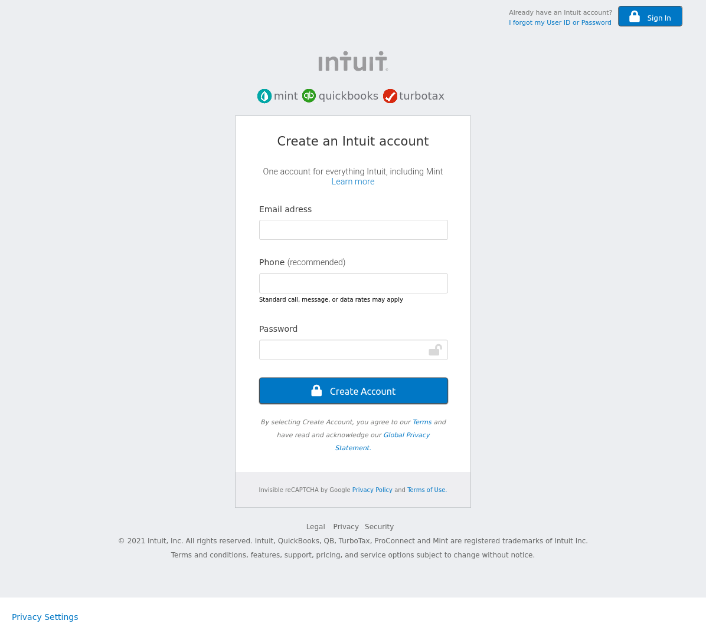

# MintSignup-Clone
> This project is a clone of the Mint.com’s signup page ,built to demostrate the author's learned knowledge of HTML5 and CSS3.


## Screenshot


>This project was made to demonstrate the my understanding of basic HTML5 and CSS3 concepts; 
The ability to design Forms and its accompaning elements for inputting data

## Built With
- HTML
- CSS

## Live Demo 
[Live Link](https://raw.githack.com/RachealNakalawa/MintSignup-Clone/feature-mintsignup/index.html)

## Getting Started
To get a local copy of this repository, please run the following commands on your terminal


1. $ `cd` <folder>(This is a folder of your choice)

1. Clone this repository using:


```
$ git clone https://github.com/RachealNakalawa/MintSignup-Clone.git

```
OR
```
$ git clone git@github.com:RachealNakalawa/MintSignup-Clone.git
```


3. $ `cd` in to <MintSignup-Clone> folder and Open the index.html file in a browser of your choice.


## Authors

👤 **Racheal Nakalawa**

- Github: [RachealNakalawa](https://github.com/RachealNakalawa)
- Twitter: [@RachealNakalawa](https://twitter.com/RachealNakalawa)
- Linkedin: [racheal-nakalawa](https://linkedin.com/in/RachealNakalawa)

# 🤝 Contributing

Contributions, issues and feature requests are welcome!

Feel free to check the [issues page](https://github.com/RachealNakalawa/MintSignup-Clone/issues).

## Show your support

Give a ⭐️ if you like this project!

## Acknowledgments

- This project was originally taken from [The Odin project](https://www.theodinproject.com/paths/full-stack-javascript/courses/html-and-css/lessons/html-forms)
## 📝 License

This project is [MIT](lic.url) licensed.
